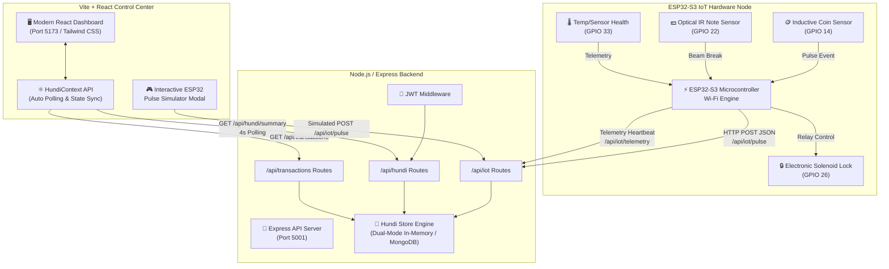
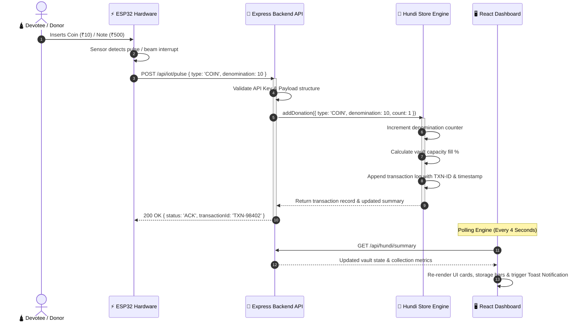
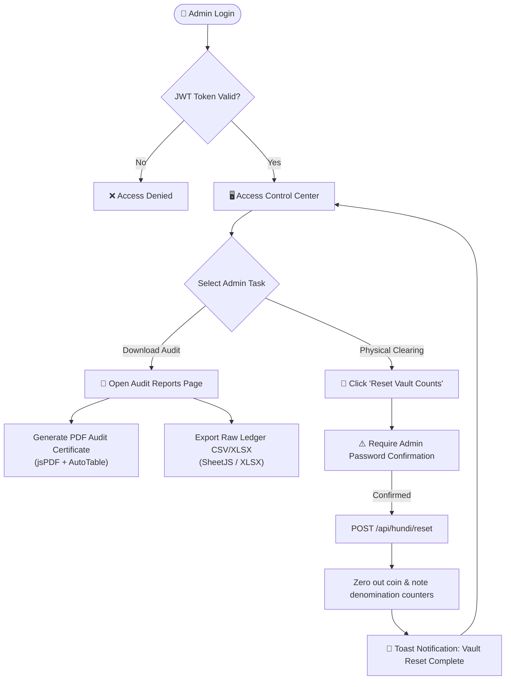

# 🕉️ Smart Hundi: Smart IoT & AI-Enabled Automated Hundi System

<div align="center">


<p align="center">
  <b>An end-to-end, real-time automated temple donation vault monitoring & financial auditing platform powered by ESP32 microcontrollers, inductive/optical hardware sensors, Express.js backend, and a modern React dashboard.</b>
</p>

[Key Features](#-key-features) • [System Architecture](#-system-architecture--data-flow) • [Hardware Wiring Guide](#-hardware--esp32-wire-guide) • [API Documentation](#-api-documentation) • [Installation & Setup](#-installation--setup-guide) • [Hardware Simulator](#-built-in-esp32-pulse-simulator)

---

</div>

## 📌 Executive Summary

Traditional temple donation collection boxes (*Hundis*) face significant operational challenges, including manual counting errors, security risks, vulnerability to theft, physical coin/note jamming, and delayed auditing cycles.

**Smart Hundi** revolutionizes devotional donation management by converting physical donation boxes into smart, connected IoT nodes. Using **ESP32 microcontrollers** equipped with **inductive coin sizing sensors** and **optical banknote counters**, donations are automatically categorized, verified, and transmitted in real-time to a central cloud dashboard.

### 🌟 Key Highlights
- **Zero-Touch Automated Currency Counting**: Instant recognition of coin denominations (₹1, ₹2, ₹5, ₹10) and currency notes (₹10, ₹20, ₹50, ₹100, ₹200, ₹500).
- **Sub-Second Hardware Sync**: ESP32 pulse webhooks update vault capacities and global totals in real-time.
- **Fail-Safe Dual-Engine Storage**: Connects natively to MongoDB while providing an automatic **zero-config in-memory fallback engine** if no database server is present.
- **Built-in ESP32 Hardware Simulator**: Live interactive UI testing modal to simulate hardware sensor events directly from the dashboard without needing physical microcontrollers connected during software testing.
- **Comprehensive Audit & Analytics**: Export audit ledgers to Excel (`.xlsx`), generate official PDF reports (`.pdf`), and view dynamic collection analytics (Recharts).
- **Anti-Tamper & Security Monitoring**: Monitored vault capacity thresholds, ambient temperature sensors, solenoid electronic door locks, and coin/note jam detection.

---

## 📑 Table of Contents

- [📌 Executive Summary](#-executive-summary)
- [✨ Key Features](#-key-features)
- [🏗️ System Architecture & Data Flow](#-system-architecture--data-flow)
  - [1. High-Level Architecture](#1-high-level-architecture)
  - [2. Hardware-to-Cloud Pulse Flow (Sequence)](#2-hardware-to-cloud-pulse-flow-sequence)
  - [3. Financial Audit & Vault Reset Workflow](#3-financial-audit--vault-reset-workflow)
- [🔌 Hardware & ESP32 Wire Guide](#-hardware--esp32-wire-guide)
  - [Hardware Bill of Materials (BOM)](#hardware-bill-of-materials-bom)
  - [GPIO Pinout Configuration](#gpio-pinout-configuration)
  - [Sample ESP32 C++/Arduino Code](#sample-esp32-carduino-code)
- [📁 Project Directory Structure](#-project-directory-structure)
- [📡 API Documentation](#-api-documentation)
  - [Authentication Endpoints](#1-authentication-endpoints)
  - [IoT Hardware Webhooks](#2-iot-hardware-webhooks)
  - [Hundi Vault Telemetry](#3-hundi-vault-telemetry)
  - [Transaction Ledger](#4-transaction-ledger)
- [🚀 Installation & Setup Guide](#-installation--setup-guide)
  - [Prerequisites](#prerequisites)
  - [1. Backend Setup](#1-backend-setup)
  - [2. Frontend Setup](#2-frontend-setup)
- [🎮 Built-in ESP32 Pulse Simulator](#-built-in-esp32-pulse-simulator)
- [🔒 Security & Authentication](#-security--authentication)

---

## ✨ Key Features

| Feature | Description |
| :--- | :--- |
| **🪙 Inductive Coin Counter** | Detects coin size and metallic pulse via Inductive Proximity Sensors mapped to ESP32 GPIO pins. |
| **💵 Optical Note Counter** | Measures bill pass-through speed and length using high-speed Infrared (IR) beam-break sensors. |
| **🚨 Anti-Jamming & Diagnostics** | Continuous heartbeat checks detect coin path blockages, banknote paper jams, or door lock tampering. |
| **📊 Real-time Dashboard** | Visual representations of coin box capacities, note vault fill levels, temperature, and live transaction feeds. |
| **📈 Dynamic Analytics** | Breakdown by denomination, peak donation hours analysis, coin-to-note distribution ratio, and time-series growth. |
| **📜 Financial Audit Ledger** | Filterable, searchable transaction log with timestamped verifications for complete auditing transparency. |
| **📄 PDF & Excel Exporters** | Generate formal temple trust audit certificates and download raw ledger data with single-click actions. |
| **🔑 Role-Based Access Control** | JWT-authenticated admin access protecting vault reset triggers and configuration settings. |
| **⚡ Zero-Config Dev Setup** | Runs out-of-the-box using in-memory state fallback when MongoDB is not installed. |

---

## 🏗️ System Architecture & Data Flow

### 1. High-Level Architecture

The Smart Hundi ecosystem consists of three distinct layers: **Hardware & Sensors**, **Backend API Server**, and **Frontend Client Control Center**.



---

### 2. Hardware-to-Cloud Pulse Flow (Sequence)

This diagram details the sub-second execution path when a coin or currency note is dropped into the physical Hundi box.



---

### 3. Financial Audit & Vault Reset Workflow

This diagram highlights the administrative cycle for performing a physical clearance of the donation box and clearing system counters.



---

## 🔌 Hardware & ESP32 Wire Guide

### Hardware Bill of Materials (BOM)

| Component | Quantity | Purpose |
| :--- | :--- | :--- |
| **ESP32-S3 Board** | 1 | Master IoT Processor with integrated 2.4GHz Wi-Fi |
| **LJ12A3-4-Z/BX Inductive Proximity Sensors** | 4 | Coin size detection (₹1, ₹2, ₹5, ₹10) |
| **IR Optical Beam Sensors** | 6 | Banknote detection & counter (₹10 - ₹500) |
| **12V Solenoid Door Lock** | 1 | Electronic access control for money retrieval door |
| **DS18B20 Temperature Sensor** | 1 | Ambient temperature monitoring to prevent thermal issues |
| **12V 2A Power Supply** | 1 | Main system power with 5V step-down buck converter |

### GPIO Pinout Configuration

| ESP32 Pin | Connected Hardware Component | Logic Signal |
| :--- | :--- | :--- |
| `GPIO 14` | Inductive Coin Counter (₹1, ₹2, ₹5, ₹10) | `PULSE_HIGH` |
| `GPIO 22` | Optical IR Banknote Counter (₹10 - ₹500) | `BEAM_BREAK_LOW` |
| `GPIO 26` | Solenoid Door Lock Relay | `HIGH = UNLOCKED` |
| `GPIO 33` | DS18B20 Temperature Sensor | `ONE_WIRE_BUS` |
| `GPIO 2` | System Status LED (Green = Online, Red = Jammed) | `PWM` |

### Sample ESP32 C++/Arduino Code

Below is a complete, deployable C++ snippet for uploading to the ESP32 microcontroller using **Arduino IDE** or **PlatformIO**.

```cpp
#include <WiFi.h>
#include <HTTPClient.h>
#include <ArduinoJson.h>

const char* ssid = "YOUR_WIFI_SSID";
const char* password = "YOUR_WIFI_PASSWORD";
const char* serverUrl = "http://YOUR_SERVER_IP:5001/api/iot/pulse";
const char* apiKey = "ESP32_HUNDI_API_KEY_SECRET";

const int COIN_SENSOR_PIN = 14;
int lastCoinState = LOW;

void setup() {
  Serial.begin(115200);
  pinMode(COIN_SENSOR_PIN, INPUT_PULLUP);

  WiFi.begin(ssid, password);
  while (WiFi.status() != WL_CONNECTED) {
    delay(500);
    Serial.print(".");
  }
  Serial.println("\n✅ Connected to Wi-Fi!");
}

void sendPulse(const char* type, int denomination) {
  if (WiFi.status() == WL_CONNECTED) {
    HTTPClient http;
    http.begin(serverUrl);
    http.addHeader("Content-Type", "application/json");

    StaticJsonDocument<200> doc;
    doc["apiKey"] = apiKey;
    doc["hundiId"] = "TH-MAIN-01";
    doc["type"] = type;
    doc["denomination"] = denomination;
    doc["count"] = 1;
    doc["sensorChannel"] = "GPIO_14_INDUCTIVE";

    String jsonPayload;
    serializeJson(doc, jsonPayload);

    int httpResponseCode = http.POST(jsonPayload);
    if (httpResponseCode > 0) {
      Serial.printf("📡 Pulse Sent! Response Code: %d\n", httpResponseCode);
    } else {
      Serial.printf("❌ Error sending POST: %s\n", http.errorToString(httpResponseCode).c_str());
    }
    http.end();
  }
}

void loop() {
  int coinState = digitalRead(COIN_SENSOR_PIN);
  if (coinState == HIGH && lastCoinState == LOW) {
    Serial.println("🪙 Coin passage detected!");
    sendPulse("COIN", 10); // Transmit ₹10 coin pulse
    delay(300); // Debounce delay
  }
  lastCoinState = coinState;
}
```

---

## 📁 Project Directory Structure

```
Smart Hundi/
├── backend/                        # Node.js & Express API Server
│   ├── config/
│   │   └── db.js                   # Mongoose DB connection & Fallback handler
│   ├── models/
│   │   ├── HundiState.js           # Schema for Hundi telemetry & counts
│   │   └── Transaction.js          # Schema for individual donation records
│   ├── routes/
│   │   ├── auth.js                 # JWT admin login & verification
│   │   ├── hundi.js                # Vault summaries, reset, and alerts
│   │   ├── iot.js                  # ESP32 webhook endpoints (pulse & telemetry)
│   │   └── transactions.js         # Transaction fetching & manual insertion
│   ├── services/
│   │   └── hundiStore.js           # Core state store engine (In-Memory fallback)
│   ├── .env                        # Backend environment configuration
│   ├── package.json                # Server dependencies & scripts
│   └── server.js                   # Main application entry point
│
└── frontend/                       # React 18 & Vite Control Center Client
    ├── public/                     # Static web assets
    ├── src/
    │   ├── components/             # Reusable UI Components
    │   │   ├── AddDonationModal.jsx        # Manual deposit UI
    │   │   ├── AnalyticsSection.jsx        # Recharts visualization engine
    │   │   ├── DenominationCard.jsx        # Denomination counter widget
    │   │   ├── Esp32SimulatorModal.jsx     # Hardware simulator modal
    │   │   ├── MachineStatusPanel.jsx      # Hardware health indicators
    │   │   ├── Navbar.jsx                  # Header navigation & quick triggers
    │   │   ├── RecentTransactionsTable.jsx # Transaction ledger
    │   │   ├── ResetConfirmModal.jsx       # Vault reset modal
    │   │   ├── Sidebar.jsx                 # Collapsible dashboard sidebar
    │   │   ├── StatCard.jsx                # Metric display card
    │   │   ├── StorageBar.jsx              # Vault fill level gauge
    │   │   ├── SystemAlertsBanner.jsx      # Real-time alert notifications
    │   │   └── ToastNotification.jsx       # Real-time event popups
    │   ├── context/
    │   │   ├── AuthContext.jsx             # User authentication state
    │   │   └── HundiContext.jsx            # Polling engine & store context
    │   ├── pages/                  # Page Views
    │   │   ├── AlertsPage.jsx              # Machine diagnostics & jams
    │   │   ├── AnalyticsPage.jsx           # Revenue charts & distribution
    │   │   ├── CoinsPage.jsx               # Coin breakdown & box fill levels
    │   │   ├── DashboardPage.jsx           # Main system dashboard overview
    │   │   ├── LiveCollectionPage.jsx      # Real-time collection stream
    │   │   ├── LoginPage.jsx               # Secure admin login screen
    │   │   ├── NotesPage.jsx               # Currency note denomination breakdown
    │   │   ├── ReportsPage.jsx             # PDF audit report generator
    │   │   ├── SettingsPage.jsx            # ESP32 API keys & system parameters
    │   │   ├── StoragePage.jsx             # Vault physical fill metrics
    │   │   ├── SystemDiagnosticsPage.jsx   # Microcontroller telemetry
    │   │   └── TransactionsPage.jsx        # Complete filterable audit ledger
    │   ├── App.jsx                 # Main React layout routing
    │   ├── index.css               # Design system, themes & glassmorphism styling
    │   └── main.jsx                # Application root mounting
    ├── index.html                  # HTML5 entry page with custom fonts
    ├── tailwind.config.js          # Custom color tokens (Gold palette, surface scales)
    ├── vite.config.js              # Vite bundler & API proxy config
    └── package.json                # Client dependencies
```

---

## 📡 API Documentation

### 1. Authentication Endpoints

#### `POST /api/auth/login`
Authenticates temple administration credentials and issues a JWT token.

- **Request Body:**
```json
{
  "username": "admin",
  "password": "adminpassword123"
}
```
- **Response (200 OK):**
```json
{
  "success": true,
  "token": "eyJhbGciOiJIUzI1NiIsInR5cCI6IkpXVCJ9...",
  "user": {
    "username": "admin",
    "name": "Sri Temple Chief Administrator",
    "role": "SUPER_ADMIN"
  }
}
```

---

### 2. IoT Hardware Webhooks

#### `POST /api/iot/pulse`
Triggered directly by the ESP32 microcontroller when a coin or banknote passes through a counter sensor.

- **Headers:** `Content-Type: application/json`
- **Request Body:**
```json
{
  "apiKey": "ESP32_HUNDI_API_KEY_SECRET",
  "hundiId": "TH-MAIN-01",
  "type": "COIN",
  "denomination": 10,
  "count": 1,
  "sensorChannel": "GPIO_14_INDUCTIVE"
}
```
- **Response (200 OK):**
```json
{
  "status": "ACK",
  "receivedAt": "2026-08-09T23:00:00.000Z",
  "transactionId": "TXN-98405",
  "summary": {
    "totalCollection": 15450,
    "totalCoins": 8550,
    "totalNotes": 6900
  }
}
```

#### `POST /api/iot/telemetry`
Heartbeat signal transmitted by ESP32 to report health diagnostics.

- **Request Body:**
```json
{
  "isOnline": true,
  "temperature": 31.8,
  "coinJam": false,
  "noteJam": false,
  "wifiSignal": -54,
  "sensorHealth": "OPTIMAL"
}
```

---

### 3. Hundi Vault Telemetry

#### `GET /api/hundi/summary`
Returns comprehensive vault capacity calculations, denomination breakdown, and total monetary collection.

- **Response (200 OK):**
```json
{
  "success": true,
  "data": {
    "totalCollection": 287730,
    "totalCoins": 28320,
    "totalNotes": 259410,
    "coinCount": 8550,
    "noteCount": 3390,
    "machineStatus": {
      "isOnline": true,
      "coinJam": false,
      "noteJam": false,
      "doorLocked": true,
      "temperature": 32.5
    },
    "capacities": {
      "overallFillPercentage": 64.2
    }
  }
}
```

#### `POST /api/hundi/reset`
Resets all physical vault denomination counters to zero after an authorized physical money collection.

- **Headers:** `Authorization: Bearer <TOKEN>`
- **Response (200 OK):**
```json
{
  "success": true,
  "message": "All vault denomination counts successfully reset to zero."
}
```

---

### 4. Transaction Ledger

#### `GET /api/transactions`
Retrieves timestamped donation audit logs with optional search filtering.

- **Query Parameters:**
  - `search` *(optional)*: Filter by transaction ID, channel, or denomination.
  - `filterDate` *(optional)*: `all`, `today`, `7days`, `30days`.
- **Response (200 OK):**
```json
{
  "success": true,
  "count": 2,
  "data": [
    {
      "id": "TXN-98401",
      "timestamp": "2026-08-09T22:45:00.000Z",
      "type": "NOTE",
      "denomination": 500,
      "count": 4,
      "amount": 2000,
      "channel": "Optical Vault Sensor",
      "status": "Verified"
    }
  ]
}
```

---

## 🚀 Installation & Setup Guide

### Prerequisites
- **Node.js**: `v18.0.0` or higher installed
- **npm** (comes with Node.js)
- *(Optional)* **MongoDB**: Local instance running on `mongodb://127.0.0.1:27017` (If MongoDB is not installed, the application automatically uses its high-performance in-memory dataset).

---

### 1. Backend Setup

1. Open your terminal and navigate to the backend directory:
   ```bash
   cd backend
   ```

2. Install backend dependencies:
   ```bash
   npm install
   ```

3. Create or inspect the `.env` file inside `backend/`:
   ```env
   PORT=5001
   MONGODB_URI=mongodb://127.0.0.1:27017/smart_hundi
   JWT_SECRET=smart_hundi_secret_key_2026
   ```

4. Start the backend development server:
   ```bash
   npm run dev
   ```
   > 🚀 Backend server will launch on **http://localhost:5001**

---

### 2. Frontend Setup

1. Open a new terminal window and navigate to the frontend directory:
   ```bash
   cd frontend
   ```

2. Install frontend dependencies:
   ```bash
   npm install
   ```

3. Start the Vite development client:
   ```bash
   npm run dev
   ```
   > 💻 Dashboard will launch on **http://localhost:5173**

4. **Default Admin Login Credentials**:
   - **Username**: `admin`
   - **Password**: `adminpassword123`

---

## 🎮 Built-in ESP32 Pulse Simulator

Don't have physical ESP32 hardware or sensors connected right now? **No problem!**

Smart Hundi includes a **built-in interactive ESP32 Hardware Simulator** inside the React dashboard.

### How to use the Simulator:
1. Log into the dashboard (`admin` / `adminpassword123`).
2. Click the **"ESP32 Simulator"** button in the top navigation bar.
3. Select a **Sensor Type** (`COIN` or `NOTE`), choose a **Denomination** (e.g. ₹500), and enter a **Count** (e.g. 5).
4. Click **"Send Simulated Pulse"**.
5. Observe how the backend processes the raw HTTP request over `/api/iot/pulse`, updates vault capacity metrics, updates the live charts, and triggers real-time toast notifications!

---

## 🔒 Security & Authentication

- **JWT Session Tokens**: Protected actions (such as resetting vault counters or modifying system parameters) require a valid JSON Web Token signed with `JWT_SECRET`.
- **ESP32 API Key Validation**: Microcontroller webhooks require an API key header (`ESP32_HUNDI_API_KEY_SECRET`) to prevent unauthorized transaction injections.
- **Physical Lock Monitoring**: Integrated telemetry monitors whether the physical access door is securely latched or opened.

---

<div align="center">

<b>Smart Hundi System</b> — Engineered for Precision, Transparency & Security.

</div>

